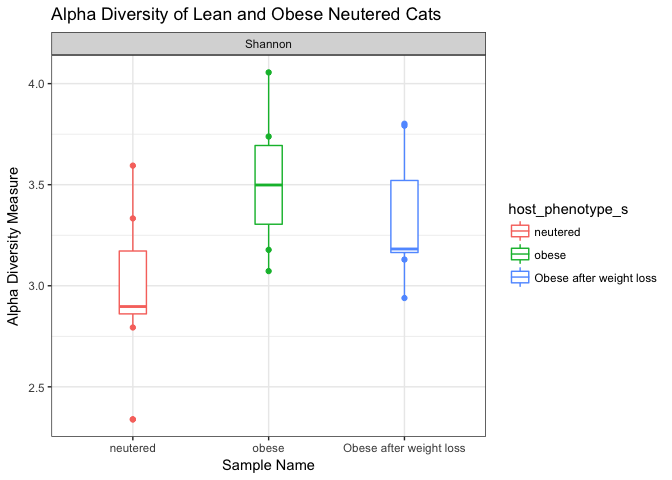
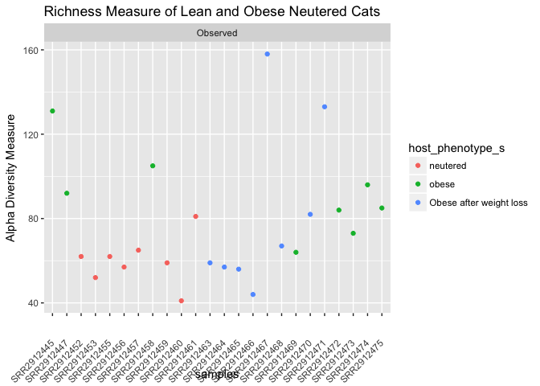
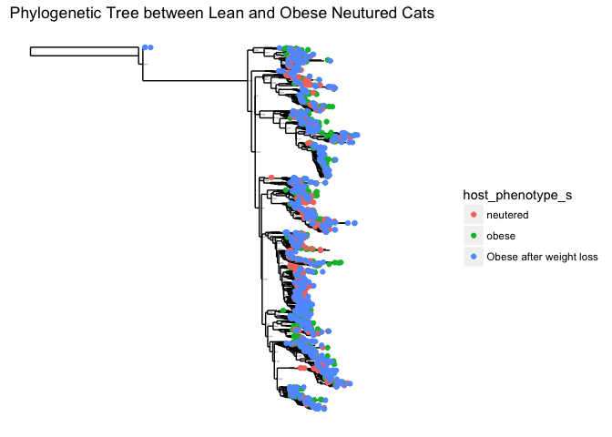
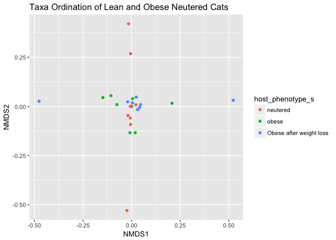
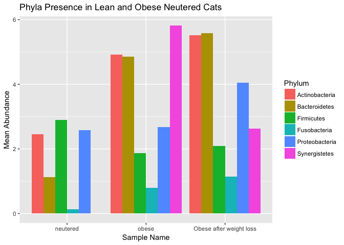
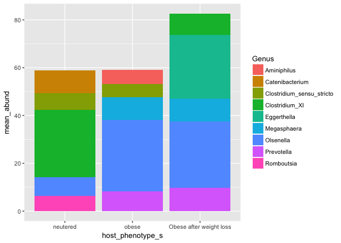

Final Report: Microbial Analysis in Lean and Obese Neutered Cats
================
Isabella Finney
December 14, 2017

Introduction
============

In the past couple of years, the images “fat cats” have become a popular sight on many social media networks, ranging from funny videos of cats toppling over and fat cat memes to having entire pages dedicated to showcasing fat cats. Mainstream media glorifies and even commodifies from these images of fat cats because they’re seen as “adorable and funny”. One of the main problems presented here is the polarization of obesity between humans and animals. The risk of obesity in humans is something that the majority society views as a public health issue that needs to be eradicated. In contrast, obesity in domesticated animals, especially cats, are something to be celebrated so often owners continue to reward their fury friends with more food and treats which contributes to them gaining even more weight and eventually experiencing obesity.

Obesity is defined as the accumulation of excess adipose tissue in the body that is sufficient enough to impair body health or function. Those categorized as obese are generally considered to be 25-27% above the ideal body weight (Linder and Mueller, 2014). Obesity is a disorder that humans and domesticated animals, like cats, commonly suffer from. Both humans and domesticated animals are experiencing a steady increase in the number of affected individuals (Scarlett *et al.*, 1994). Obesity is usually the result of an imbalance in dietary intake, energy utilization, or genetics. The factors that may lead to these imbalances range from a variety of internal and causes like activity level, environmental lifestyle, hormonal levels, and genetics. Some of the effects that obesity can have on domesticated animals can be highly detrimental. It can lead to problems such as orthopedic disease, diabetes, cardiorespiratory disease, urinary disorders, dermatological diseases, and neoplasia (German, 2006). The culmination of these problems eventually leads an overall poor health and an inevitable increase in mortality.

Currently, the prevalence of obese and overweight cats has been calculated between 40-60% (Colliard *et al.*, 2009). The relationship between cats and their human owners is important because it affects the dietary and behavioral development in many of the cats that are overweight or obese. Many obese cats fail to establish normal feeding behaviors, Controlled satiety, and adept exercise as a result of misinterpretation and lack of attention from their owners. For dogs, eating and exercise are activities that are shared socially between the dog and its human. Because owners are actively engaged with their dogs, there is more control over the balance how much the dog intakes as well as how much exercise the dog receives. The dynamic between cats and their owners is often much less connected. Most cats, in contrast, do not seek or need as much social interaction with their owners so this leads to their owners having less supervision over their health. Owners will often assume that their cat is asking for food when they initiate contact (Kienzle *et al.*, 2001). Their behaviors get misinterpreted and their owner gives them food which then results in the cat learning that initiating contact results in a reward of food. Obviously, the cat will continue this behavior more often and the owner will continue to provide “the reward”. Now, the cat will have an imbalance in the amount of dietary intake and exercise their receiving on a daily basis which leads to the cat becoming obese.

One of the most prevalent and studied factors for the cause of obesity in cats is neutering. It has been highly suggested that neutering causes a decrease in the metabolic rate of these animals (Hoenig and Ferguson, 2002). Scientists have also noted that neutering also leads to these animals having an increased intake in food consumption from the culmination of more satiety hormones (Flynn *et al.*, 1996). Although neutering can be linked to an increase in weight gain and obesity, the positive effect it is has in population control and the environment is highly beneficial. About 100 million feral and abandoned cats reside in the United States. These are cats are responsible for about almost a billion injuries or deaths that occur among other wildlife like birds, small mammals, reptiles, amphibians, and fish (Scott *et al.*, 2002). Thanks to programs that practice trap-neuter-return (TNR) practices or rescues, the number of the feline population can be better controlled as well as the longevity of other wildlife populations (Gibson *et al.*, 2002). Because the benefits of neutering outweigh the negative effects, most pet owners will often choose the former so other measures need to be taken to prevent this growing issue. The most common solutions to treating and preventing obesity are with diet restriction and energy expenditure (Sloth, 1992). Although these solutions can be effective, they often rely on the dedication of the individual pet owner to provide adequate treatment which is not always the most reliable option especially when considering serious cases of obesity. Presently, there are no medical applications that have been implemented to solve this problem. One potential strategy could be to examine how the microbiome of obese cats differs from that of lean cats. In studies done on mice, high-fat diets have been linked to differences in the ratio of certain genus species. Focusing on these possible differences could potentially lead to new applications for obesity treatment in the feline population.

Manuel A. Fischer et al. published a paper titled *Effects of obesity, energy restriction and neutering on the faecal microbiota of cats* where they performed a broad experiment that looked at the overall differences in the microbiota between lean cats that were neutered and intact and neutered obese cats before and after undergoing energy restriction. The focus of my investigation was to observe the level of diversity using abundance and richness over the different types of neutered cats using the dataset I obtained from this study. Looking at these variables for this particular dataset, I hoped to determine exactly which microbial communities caused those differences. I hypothesized that there would be distinctive differences in the diversity and abundance in the microbial communities between lean and obese cats which contribute to the present differences seen in their weight.

Methods
=======

Study design
------------

Twenty-four domestic shorthair cats, with ages ranging from 1-12 years, were obtained from the University of California. Using a body condition score system (Laflamme, 1997), Fischer et al. determined which cats were considered lean or obese. They chose eight obese (4 male and 4 female); eight lean intact (4 male and 4 female); and eight lean neutered (6 male and 2 female) cats. Neutered cats were either castrated or spayed about 1-6 years before the start of the study. To control the specimens’ environmental factors, all cats were housed together in a temperature and enriched controlled facility. Each cat was also brushed and socialized once a day. The scientists ensured that each cat was given the same dry-type diet for two before the experiment as well as throughout the duration of the study. They ensured that diet provided met all of the standard nutritional recommendations for cats of all ages (Freeman *et al.*, 2013). Cats were fed a diet that consisted of proportional rates of protein, fat, N-free extract, dietary fibre, and ash. Although food intake for each specimen was not exactly measured, weekly recordings showed that each cat kept a consistent weight. Particular steps were taken to preform energy restriction on obese neutered cats. For 10 days, these cats were briefly individually housed during their feeding times and were weighed to ensure food intake stability. For the next 6 weeks, the cats were fed 60-70% of their previous energy intake to obtain a 0.5-1% in weight loss every week. Each cat had their body weight measured every week and a body composition scored was recorded every other week.

Sample origin and sequencing
----------------------------

### Determining Body Composition

To determine body fat mass and fat free mass, Fischer et al. used a deuterium oxide (D2O) isotopic dilution method purchased from Fisher Scientific. This technique essentially applies a deuterium dilution to some bodily fluid in order to measure the total body water present in the body (Lukaski and Johnson, 1985). For this experiment, a blood sample was taken 12 hours after food fasting and 2 hours after water was withheld. To collect blood and faecal samples, each cat (obese, lean, intact, and neutered) was temporarily housed in a separate location. The dilution was applied to each subcutaneously, or “under the skin” and then after allowing the dilution to equilibrate from a few hours, another blood sample was collected. An IR spectrometer with a class 2A laser was used to analyze the sample.

### Faecal Collection and Bacterial Sequencing

Fresh faecal samples were collected from litter boxes once a day over the period of three days. These samples were placed in sterile tubes and stored at -80 degrees Celsius. To determine that each sample collected was considered “fresh”, Fischer and other staff at the facility observed the cats every 15 minutes and only the faeces produced during this time period was collected.A DNA extraction kit, sold as the Mo Bio PowerSoil Kit, used a bead-beading method on each sample to remove the DNA. This method works by placing beads into a tube sample and mechanically shaking the tube to create collisions between the sample material and the beads (Fujimoto *et al.*, 2004). After retrieving the DNA from each tube, the 16R rRNA genes were chosen to be sequenced from each sample. Amplification of this area was preformed using a universal bacterial primer. After, the scientists ran a series of 30-cycle PCR reactions to create multiple copies of each sequence. The amplicon products from each sample was were pooled together in equal concentrations to be purified with beads. The sequences were processed in a Roche 454 sequencer. The beads from the PCR reactions were placed into wells on a sequencing plate where nucleotide bases are added to each well. From there, light is given out to the wells and depending on the light intensity that the camera records, the wells will display the number of nucleotides of the same type (Rothberg and Leamon, 2008). Sequences were trimmed and those with less than 150 base pairs were removed as well as those with ambiguous base calls and large homopolymers. Operational taxonomic units (OTU) were gathered from de-noised sequences and chimeras were removed. Using BLASTn, these OTU were taxonomically classified against an established database. The OTU that were classified were compiled into each taxonomic level and rarefaction, or density lessening, was perfromed to remove biases within the sequences. The raw sequences were then deposited at the NCBI Sequence Read Archive.

Computational
-------------

The process to computationally parse and analyze the data gathered was accomplished using a systematic workflow. The process to computationally parse and analyze the data gathered was accomplished using a systematic workflow. The first step was to download the SRA table from NCBI. Using Terminal, I downloaded the SRA toolkit onto my computer and created a for loop script that would download the sequences. I then created an RScript that would parse the sequences downloaded. Next was to install all the necessary packages needed to get the dataset in the best suited format possible. The first step was to install all the necessary packages needed to get the dataset in the best suited format possible. In particular, the two most important packages that were installed were DADA2 and phyloseq. DADA2 is a type of open-software package that’s designed to model and correct Illumina-sequenced amplicon errors. It is able to directly extrapolate sequences and accurately resolve any error in as little as 1 nucleotide base (Callahan *et al.*, 2016). The phyloseq pack is also an open-software. This software project was made to preform analysis of microbiome census data present in R. It imports data and allows a user to preform various types of analysis like subsetting, multi-table comparisons, and diversity analysis (McMurdie and Holmes, 2013). This package essentially allowed me to make the different figures comparing the data between men and women. The metadata set was first downloaded from the NCBI database. Then through the creation of a fastq processing script, the metadata was thoroughly trimmed based on a set of parameters determined from the 454 sequencer. From here, DADA2 does its job to check for errors in each of the samples. After doing quality checks on the trimmed and denoised sequences, chimeras were removed from the sequences in order to obtain a cleaner read. Chimeras are formed from two miscloned and joined DNA sequences. The cleaned sequences variants were assigned taxonomy based on known sequences and then a phylogeny was created from a fasta file format of the data. A phyloseq object was constructed from the DADA2 output. Using dplyr and the psmelt function, a melted table was created from that phyloseq object. This process combines all the sample information, OTU, taxonomic classification into a single dataframe to produce graphics easily. Both objects were added to an Rmd file where I eventually created the figures for my analysis. Another important component I added to help create my figures was downloading a platform called Geneious. Essentially this platform is as a software application framework that serves to organize and analyze biological data (Kearse *et al.*, 2012). I used this software to create my phylogenetic tree.

Results
=======

For all figures that are grouped by the sample types “neutered”, “obese”, and “Obese after weight loss”: “Neutered” stands for neutered lean cats, “obese” stands for neutered obese cats, and “Obese after weight loss” represents the sequences that were taken from the obese cats after energy restriction.

Microbial Diversity
-------------------

The first thing I investigated was the alpha diversity present in all samples types for neutered cats (Figure 1 and 2). Alpha diversity measures the diversity present at the local species scale. Here, I used three different diversity metrics (Shannon entropy, Simpson’s index, and species richness) to compare whether the level microbial diversity present translated across different measured interpretations. Ecologically, richness shows the number of different species that are represented within the community (without taking into account the outliers, or rarities, present within each sample). Shannon entropy calculates diversity by quantifying the entropy present with a species. It looks at both the abundance and evenness within the present species (Fierer and Jackson, 2006). Simpson’s index calculates the probability of species presence (Grundmann *et al.*, 2001). Looking all at every single sample, I noticed there was about the same measure of diversity in the obese cats (before and after energy restriction). The observed data shows that obese cats showed more alpha diversity than the neutered lean cats. This finding was further supported when the sample were plotted using Shannon entropy and Simpson’s index. These two indices showed that within the microorganisms found on all obese cats, there was much less evenness present. Another interesting observation to note is that neutered obese cats before undergoing a diet restriction showed the highest level of microbial diversity.

**Figure 1**: Alpha diversity measures of the three sample types, neutered obese and lean cats. Overall, there is a substantial amount of microbial diversity present among each sample type.

**Figure 2**: Alpha richness of each particular sample type.

Phylogeny and Ordination
------------------------

Seeing that there was a higher level of diversity and abundance present but a decrease in evenness in obese cats over lean cats, I was prompted to further investigate whether I could determine if there were any specific microbiota that were cause of this differentiation. Making phylogenetic tree and a plot ordination on taxa gave me a preliminary view on the ordering of the taxa and phylum present within the different cat phenotypes. Using a programming tool called Geneious, I then created a phylogenetic tree to see if any of these phenotypes shared any evolutionary relationships within their microbiota (Figure 3). The patterns in the branching of the tree reflect how the species evolved from common ancestors. The tips of the tree represent samples where each particular taxa occurred. The tree itself represents the maximum likelihood of phylogeny (Gouy *et al.*, 2009). For this dataset, the phylogenetic tree didn’t present any distinctive relationships in the microbiota. Each of the phenotypes seemed to be represented in each branch equally. The plot ordination showed that the majority of the taxa present within lean and obese cats are highly similar to one another, with only a few differences in each sample type (Figure 4).

**Figure 3**: This is an inferred phylogenetic tree of sequences present within the three sample types.

    ## Square root transformation
    ## Wisconsin double standardization
    ## Run 0 stress 0 
    ## Run 1 stress 0 
    ## ... Procrustes: rmse 0.1921411  max resid 0.5083251 
    ## Run 2 stress 0 
    ## ... Procrustes: rmse 0.1900951  max resid 0.4315134 
    ## Run 3 stress 0 
    ## ... Procrustes: rmse 0.2017923  max resid 0.4837147 
    ## Run 4 stress 0 
    ## ... Procrustes: rmse 0.1893849  max resid 0.4263946 
    ## Run 5 stress 0 
    ## ... Procrustes: rmse 0.2010376  max resid 0.4838977 
    ## Run 6 stress 0 
    ## ... Procrustes: rmse 0.1983948  max resid 0.4478037 
    ## Run 7 stress 0 
    ## ... Procrustes: rmse 0.1970312  max resid 0.4306161 
    ## Run 8 stress 0 
    ## ... Procrustes: rmse 0.203319  max resid 0.4955988 
    ## Run 9 stress 0 
    ## ... Procrustes: rmse 0.1916327  max resid 0.4371424 
    ## Run 10 stress 0 
    ## ... Procrustes: rmse 0.1978367  max resid 0.52999 
    ## Run 11 stress 0 
    ## ... Procrustes: rmse 0.1994614  max resid 0.4762856 
    ## Run 12 stress 0 
    ## ... Procrustes: rmse 0.1936777  max resid 0.4312856 
    ## Run 13 stress 0 
    ## ... Procrustes: rmse 0.1966769  max resid 0.5081518 
    ## Run 14 stress 0 
    ## ... Procrustes: rmse 0.2019562  max resid 0.4813531 
    ## Run 15 stress 0 
    ## ... Procrustes: rmse 0.1972452  max resid 0.4292062 
    ## Run 16 stress 0 
    ## ... Procrustes: rmse 0.1994586  max resid 0.4558331 
    ## Run 17 stress 0 
    ## ... Procrustes: rmse 0.1955466  max resid 0.4906654 
    ## Run 18 stress 0 
    ## ... Procrustes: rmse 0.1944129  max resid 0.511624 
    ## Run 19 stress 0 
    ## ... Procrustes: rmse 0.1995067  max resid 0.5150842 
    ## Run 20 stress 0 
    ## ... Procrustes: rmse 0.1993512  max resid 0.4667588 
    ## *** No convergence -- monoMDS stopping criteria:
    ##     20: stress < smin

**Figure 4**: Plot ordination of the taxa present from each type of neutered cat.

Influence of Microbial Communities
----------------------------------

### Phyla-level Abundance

The creation of bar plots was used to observe the mean species abundance levels present among the phyla and genera of these cats. Looking at the abundance in phyla produced some interesting results (Figure 5). Among all three sample types, the phylum Actinobacteria was the second highest in abundance. In lean cats, the phylum Firmicutes had the highest level of abundance which is drastically different to its presence in obese cats where it presented as one of the lowest phyla levels. Obese cats, before and after dietary restriction, showed that Bacteriodetes was highly expressed compared to lean cats (which was the second least expressed phyla). I also observed that obese cats had the addition of the phylum Synergistetes at a very high abundance but that level of abundance was greatly reduced in the obese cats that underwent energy restrictions.

### Genera-level Abundance

Because there were so many genera, I decided to investigate the mean abundance levels in the highest expressed genera (Figure 6) as well as obtain their abundances values (Table 1). The genus *Clostridrium*, from phylum Firmicutes, expressed the highest levels of abundance in lean cats. It had a mean abundance of about 35. In contrast, the genera *Olsenella* and *Eggerthella* (from phylum Actinobacteria) are much more expressed than other genera. *Olsenella* produced a mean value of about 28 and *Eggerthella*, which is only present in energy-restricted obese cats, expressed at a value of about 27. There are some genera that are present in the highest portion that are represented in lean cats but not in obese cats and vice-versa (Table 1). Some examples of these genera are *Romboustia* and *Prevotella*. In this measure of the highest 15 abundant genera, *Romboustia* is only represented in lean cats and *Prevotella* only expresses abundance in obese cats.

**Figure 5**: Bar plot representing the mean abundance of each phyla present in each sample type (lean netured, obese neutered, and obese and neutered with energy restriction).

**Figure 6**: Bar plot representing the mean abundance of the top 5 genera present in each sample type (lean netured, obese neutered, and obese and neutered with energy restriction).

| Genus                       |   neutered|      obese|  Obese after weight loss|
|:----------------------------|----------:|----------:|------------------------:|
| Alloprevotella              |         NA|   4.318750|                       NA|
| Aminiphilus                 |         NA|   5.812500|                       NA|
| Anaerobiospirillum          |   5.296875|   4.152344|                 6.097656|
| Blautia                     |   3.545530|         NA|                       NA|
| Catenibacterium             |   9.723684|         NA|                       NA|
| Clostridium\_sensu\_stricto |   6.973404|   5.710106|                       NA|
| Clostridium\_XI             |  28.154167|   5.277083|                 8.902083|
| Clostridium\_XlVa           |         NA|         NA|                 7.190790|
| Collinsella                 |         NA|   3.396342|                       NA|
| Eggerthella                 |         NA|         NA|                26.750000|
| Enterococcus                |   4.531250|         NA|                       NA|
| Faecalicoccus               |         NA|         NA|                 5.750000|
| Hydrogenoanaerobacterium    |         NA|         NA|                 6.138393|
| Megasphaera                 |   3.740385|   9.437500|                 9.478365|
| Olsenella                   |   7.812500|  29.837500|                27.687500|
| Prevotella                  |         NA|   8.286152|                 9.829044|
| Romboutsia                  |   6.323077|         NA|                       NA|
| Slackia                     |         NA|         NA|                 5.034091|
| Streptococcus               |         NA|   3.694444|                       NA|
| Turicibacter                |   5.453125|         NA|                       NA|

**Table 1**: Summary table showing the mean abundance values for the top 15 genera present among all three sample types.

Discussion
==========

Conclusion
----------

I determined that for this particular dataset, my hypothesis was correct. By investigating the different levels of diversity, I saw that lean and obese cats did share some noticeable differences. The reason why there’s a higher level of abundance and diversity in obese cats is because there is more diversity in their microbial communities. Looking at the different microbial communities, a higher presence in certain phyla and genus explained the differences as I saw in diversity levels. Ordination and an analysis of the phylogenetic tree presented that the majority of each type of cat shared many similarities between their microbiota. Looking into the ordination of lean and obese cats, I did notice that although the microbial communities shares many similarities, there were some notable differences that I believed I could distinguish when I looked more in depth at their phylum and genus abundance levels.

Through my investigation into their specific microbiota, a higher presence in certain phyla and genus explained the differences as I saw in diversity levels. The six identified phyla (Firmicutes, Actinobacteria, Bacteroidetes, Fusobacteria, Proteobacteria, and Synergistetes) are consistent with the expected phyla seen in other faecal microbiota in cats (Deusch *et al.*, 2015). In phyla abundance, lean cats the highest level of abundance in Firmicutes but that didn't translate over to obese cats. Obese cats showed the highest level of abundance among the Synergistetes and obese cats that had undergone energy restriction showed that Bacteroidetes was most abundant in their microbiota. Previous studies have shown that Firmicutes is the most predominant phylum discovered in the intestinal tract of animals (Ritchie *et al.*, 2008) but for this dataset that was only present among the lean cats. Previous studies have also noted that there are proportional differences in the abundance of other bacterial phyla in the guts of other animals. Bacteroidetes and Firmicutes have been shown to effect the adiposity of mammals. Looking at the microbiome of these mammals, the relative abundance of Bacteroidetes increases as obese individuals lose weight (Turnbaugh *et al.*, 2006). I could see that in just those 6 weeks of energy restriction, the level of abundance in Bacteroidetes did increase. Some of the data presented in this dataset stands in contrast to what other studies have found in the relative abundance of these phyla in obese and lean cats. Usually, obese cats have a higher presence of Firmicutes than Bacteroidetes when comparing them to lean cats but that isn’t the case for my data (Ley *et al.*, 2005). These differences in their findings could point to the fact that there may be more relevant changes at lower taxonomic levels that affect the differences in weight.

Looking at the different microbial communities, some of the trends seen from phyla abundance translated over to genera abundance. For example, obese cats expressed extremely high levels of abundance in the phylum Actinobacteria and that trends followed through to genera presence as the genera *Olsenella* and *Eggerthella* was also one of the most highly expressed. This trend is also present in lean cats because the genus *Clostridrium*, from phylum Firmicutes, expressed the highest levels of abundance in lean cats. Through external research into those genera that were more expressed I did see that these species had some characteristics that affect weight gain and metabolism. In particular, *Clostridium* influences metabolism and body composition. It has been shown to facilitate carbohydrate oxidation and metabolism in that it affects the fat mass in lean cats (Kelder *et al.*, 2014). I found that for this dataset, the faecal microbiota of lean and obese cats do have some notable differences that affect weight loss and body composition. In the 6 weeks of energy restriction, obese cats did seem to have some impact on the relative abundance levels. This further shows that diet does affect how the feacal microbiota is composed.

Caveats
-------

Explaining the different variables that went into constructing the different dataset is important in understanding why my data can only be taken at face value and why some of my results are in contrast to the data found in other studies. The first thing I should address is that I didn’t take into account other variables like sex and age. These variables could prove to change the way in which faecal microbiota changes in lean and obese cats. Another caveat is that the data sample that I used was small. Only 24 cats were observed and in those 24 cats there was an even number of obese cats between gender but in the neutered lean cats there were only two females and six males that were observed. If sex plays a variable in diversity and abundance then my data could be bias as a result. The scientists from this study only performed their experiment on short-haired cats which could causes bias because there may a different story on long haired cats because of the possibility that there are genetic factors that are present between these types of cats that translate over to weight gain in their respective populations. Another caveat is that this study was only over the course of 6 months, which can be considered a relatively short time short period of time. To get a better idea at the changes that occur over these phenotypes, maybe a study could be done that took over the course of a year so that a more in-depth analysis could be done on how the microbiota changes over time. The biggest I had was in the sequences of my data. When I had to perform the pipeline, after the quality checks it was clear that were some serious errors in the sequences that forced me to make drastic cuts just so that I could even perform a sufficient enough analysis. I imagine that these errors could have translated to the issues that I saw in my own dataset in relation to what other studies have reported. For example, Firmicutes are known to be the predominant phylum in the intestinal tract of animals, especially those that are obese, that wasn’t the case for my data when I looked at the phyla abundance. In conclusion, my data is only as good as I could hope it to be. To get a better sense of how the microbiome affects obesity, further analysis should be done and higher quality sequences should be collected.

Significance and Further Directions
-----------------------------------

Prevention and management of feline obesity requires identifies the most prevalent underlying causes of the disorder in individual cats so examining the microbiome could lead to creation of new applications that could solve this issue more effectively. The reason why this research this is so important is because there aren’t sufficient enough solutions to combating obesity in cats. Mainstream media idealizes the image of fat cats, for example with the grumpy cat and fat cat memes, so people often don’t even realize there’s an issue with animal obesity. With more research into diversity and the microbiota that heavily influence obesity rates, nutritional dietary plans and medical application could be implemented to help those poor fat cats and other animals who suffer from obesity.

Sources Cited
=============

Callahan,B.J. *et al.* (2016) DADA2: High-resolution sample inference from illumina amplicon data. *Nature Methods*, **13**, 581–583.

Colliard,L. *et al.* (2009) Prevalence and risk factors of obesity in an urban population of healthy cats. *Journal of Feline Medicine & Surgery*, **11**, 135–140.

Deusch,O. *et al.* (2015) A longitudinal study of the feline faecal microbiome identifies changes into early adulthood irrespective of sexual development. *PloS one*, **10**, e0144881.

Fierer,N. and Jackson,R.B. (2006) The diversity and biogeography of soil bacterial communities. *Proceedings of the National Academy of Sciences of the United States of America*, **103**, 626–631.

Flynn,M. *et al.* (1996) Effect of ovariohysterectomy on maintenance energy requirement in cats. *Journal of the American Veterinary Medical Association*, **209**, 1572–1581.

Freeman,L.M. *et al.* (2013) Current knowledge about the risks and benefits of raw meat–based diets for dogs and cats. *Journal of the American Veterinary Medical Association*, **243**, 1549–1558.

Fujimoto,S. *et al.* (2004) Optimal bacterial dna isolation method using bead-beating technique. *Memoirs Kyushu Univ Dep Of Health Scis Of Medical Sch*, **3**, 33–38.

German,A.J. (2006) The growing problem of obesity in dogs and cats. *The Journal of Nutrition*, **136**, 1940S–1946S.

Gibson,K.L. *et al.* (2002) A trap, neuter, and release program for feral cats on prince edward island. *The Canadian Veterinary Journal*, **43**, 695.

Gouy,M. *et al.* (2009) SeaView version 4: A multiplatform graphical user interface for sequence alignment and phylogenetic tree building. *Molecular biology and evolution*, **27**, 221–224.

Grundmann,H. *et al.* (2001) Determining confidence intervals when measuring genetic diversity and the discriminatory abilities of typing methods for microorganisms. *Journal of clinical microbiology*, **39**, 4190–4192.

Hoenig,M. and Ferguson,D.C. (2002) Effects of neutering on hormonal concentrations and energy requirements in male and female cats. *American journal of veterinary research*, **63**, 634–639.

Kearse,M. *et al.* (2012) Geneious basic: An integrated and extendable desktop software platform for the organization and analysis of sequence data. *Bioinformatics*, **28**, 1647–1649.

Kelder,T. *et al.* (2014) Correlation network analysis reveals relationships between diet-induced changes in human gut microbiota and metabolic health. *Nutrition & diabetes*, **4**, e122.

Kienzle,E. *et al.* (2001) The human-animal relationship and overfeeding in cats. *Compendium on Continuing Education for the Practicing Veterinarian*, **23**, 73–73.

Laflamme,D. (1997) Development and validation of a body condition score system for cats: A clinical tool. *Feline practice (Santa Barbara, Calif.: 1990)(USA)*.

Ley,R.E. *et al.* (2005) Obesity alters gut microbial ecology. *Proceedings of the National Academy of Sciences of the United States of America*, **102**, 11070–11075.

Linder,D. and Mueller,M. (2014) Pet obesity management. *Veterinary Clinics: Small Animal Practice*, **44**, 789–806.

Lukaski,H.C. and Johnson,P.E. (1985) A simple, inexpensive method of determining total body water using a tracer dose of d2o and infrared absorption of biological fluids. *The American journal of clinical nutrition*, **41**, 363–370.

McMurdie,P.J. and Holmes,S. (2013) Phyloseq: An r package for reproducible interactive analysis and graphics of microbiome census data. *PLoS ONE*, **8**, e61217.

Ritchie,L.E. *et al.* (2008) Assessment of microbial diversity along the feline intestinal tract using 16S rRNA gene analysis. *FEMS microbiology ecology*, **66**, 590–598.

Rothberg,J.M. and Leamon,J.H. (2008) The development and impact of 454 sequencing. *Nature biotechnology*, **26**, 1117–1124.

Scarlett,J. *et al.* (1994) Overweight cats: Prevalence and risk factors. *International journal of obesity and related metabolic disorders: journal of the International Association for the Study of Obesity*, **18**, S22–8.

Scott,K.C. *et al.* (2002) Body condition of feral cats and the effect of neutering. *Journal of Applied Animal Welfare Science*, **5**, 203–213.

Sloth,C. (1992) Practical management of obesity in dogs and cats. *Journal of Small Animal Practice*, **33**, 178–182.

Turnbaugh,P.J. *et al.* (2006) An obesity-associated gut microbiome with increased capacity for energy harvest. *nature*, **444**, 1027–131.
