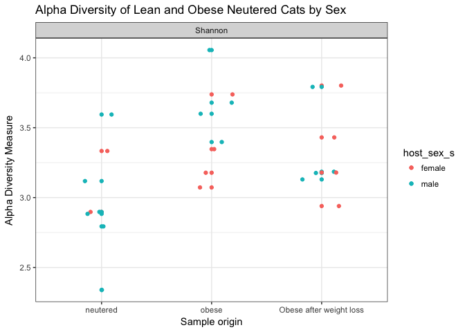

Final Report: Your Title Here
================
Don Francisco
November 22, 2017

Introduction
============

Add about 2-3 pages here. Across the whole manuscript, you should cite at least 20 peer reviewed articles.

Methods
=======

Study design
------------

Add about half a page here. In this section instead of first person (I/we), use the authors of the paper you selected, since you'll just be describing what they did, based on the methods in their paper.

Sample origin and sequencing
----------------------------

Add about half a page here. In this section instead of first person (I/we), use the authors of the paper you selected, since you'll just be describing what they did, based on the methods in their paper.

Computational
-------------

These are the methods you used to do your bioinformatic analyses analyses. Should probably be between 0.5 and 1 pages. At a very minimum should include citations for DADA2 and phyloseq if you are doing an amplicon study, or other citations as appropriate.

Results
=======

Subsections are ok in the results section too
---------------------------------------------

    ## Warning in estimate_richness(physeq, split = TRUE, measures = measures): The data you have provided does not have
    ## any singletons. This is highly suspicious. Results of richness
    ## estimates (for example) are probably unreliable, or wrong, if you have already
    ## trimmed low-abundance taxa from the data.
    ## 
    ## We recommended that you find the un-trimmed data and retry.

**Figure 1**: Alpha diversity measures of the three sample types, neutered obese and lean cats.

**Figure 2**: Alpha diversity measures of the three sample types, neutered obese and lean cats, colored by gender. Overall, there is a substantial amount of microbial diversty present among males and females in each sample type. Interestingly, the communities present among males in neutered and obese cats showed a higher measure of Shannon diverty.

**Figure 3**:

**Figure 4**: This is an inferred phylogenetic tree of sequences present within the three sample types. The tips of the tree represents samples where each particular taxa occurred. The tree itself represents the maximum likelihood of phylogengy.

    ## Square root transformation
    ## Wisconsin double standardization
    ## Run 0 stress 0 
    ## Run 1 stress 0 
    ## ... Procrustes: rmse 0.2021366  max resid 0.4554891 
    ## Run 2 stress 0 
    ## ... Procrustes: rmse 0.1940044  max resid 0.4724872 
    ## Run 3 stress 0 
    ## ... Procrustes: rmse 0.1915036  max resid 0.4433332 
    ## Run 4 stress 0 
    ## ... Procrustes: rmse 0.1983969  max resid 0.4732628 
    ## Run 5 stress 0 
    ## ... Procrustes: rmse 0.1956069  max resid 0.4969752 
    ## Run 6 stress 0 
    ## ... Procrustes: rmse 0.2025706  max resid 0.4957503 
    ## Run 7 stress 0 
    ## ... Procrustes: rmse 0.1953478  max resid 0.4563855 
    ## Run 8 stress 0 
    ## ... Procrustes: rmse 0.2012722  max resid 0.4592369 
    ## Run 9 stress 0 
    ## ... Procrustes: rmse 0.196237  max resid 0.4677451 
    ## Run 10 stress 0 
    ## ... Procrustes: rmse 0.186782  max resid 0.48226 
    ## Run 11 stress 0 
    ## ... Procrustes: rmse 0.202516  max resid 0.4691742 
    ## Run 12 stress 0 
    ## ... Procrustes: rmse 0.1991476  max resid 0.4916595 
    ## Run 13 stress 0 
    ## ... Procrustes: rmse 0.1949483  max resid 0.4886636 
    ## Run 14 stress 0 
    ## ... Procrustes: rmse 0.2022027  max resid 0.4854359 
    ## Run 15 stress 0 
    ## ... Procrustes: rmse 0.2015296  max resid 0.4950734 
    ## Run 16 stress 0 
    ## ... Procrustes: rmse 0.1940311  max resid 0.4369521 
    ## Run 17 stress 0 
    ## ... Procrustes: rmse 0.1991258  max resid 0.5074273 
    ## Run 18 stress 0 
    ## ... Procrustes: rmse 0.198115  max resid 0.5167274 
    ## Run 19 stress 0 
    ## ... Procrustes: rmse 0.2006332  max resid 0.4799402 
    ## Run 20 stress 0 
    ## ... Procrustes: rmse 0.1986183  max resid 0.5105295 
    ## *** No convergence -- monoMDS stopping criteria:
    ##     20: stress < smin

**FIGUREEEEEEE**:

\*\*FIGUREEEEEEE\*:

**FIGUREEEEE**:

| Genus                       |   neutered|      obese|  Obese after weight loss|
|:----------------------------|----------:|----------:|------------------------:|
| Alloprevotella              |         NA|   4.318750|                       NA|
| Aminiphilus                 |         NA|   5.812500|                       NA|
| Anaerobiospirillum          |   5.296875|   4.152344|                 6.097656|
| Blautia                     |   3.545530|         NA|                       NA|
| Catenibacterium             |   9.723684|         NA|                       NA|
| Clostridium\_sensu\_stricto |   6.973404|   5.710106|                       NA|
| Clostridium\_XI             |  28.154167|   5.277083|                 8.902083|
| Clostridium\_XlVa           |         NA|         NA|                 7.190790|
| Collinsella                 |         NA|   3.396342|                       NA|
| Eggerthella                 |         NA|         NA|                26.750000|
| Enterococcus                |   4.531250|         NA|                       NA|
| Faecalicoccus               |         NA|         NA|                 5.750000|
| Hydrogenoanaerobacterium    |         NA|         NA|                 6.138393|
| Megasphaera                 |   3.740385|   9.437500|                 9.478365|
| Olsenella                   |   7.812500|  29.837500|                27.687500|
| Prevotella                  |         NA|   8.286152|                 9.829044|
| Romboutsia                  |   6.323077|         NA|                       NA|
| Slackia                     |         NA|         NA|                 5.034091|
| Streptococcus               |         NA|   3.694444|                       NA|
| Turicibacter                |   5.453125|         NA|                       NA|

**FIGUREEEEE**:

In addition to a minimum of 5-10 figures/tables (and associated captions), you should include sufficient text in this section to describe what your findings were. Remember that in the results section you just describe what you found, but you don't interpret it - that happens in the discussion. 2-3 pages.

Discussion
==========

Add around 3-4 pages interpreting your results and considering future directions one might take in analyzing these data.

Sources Cited
=============
