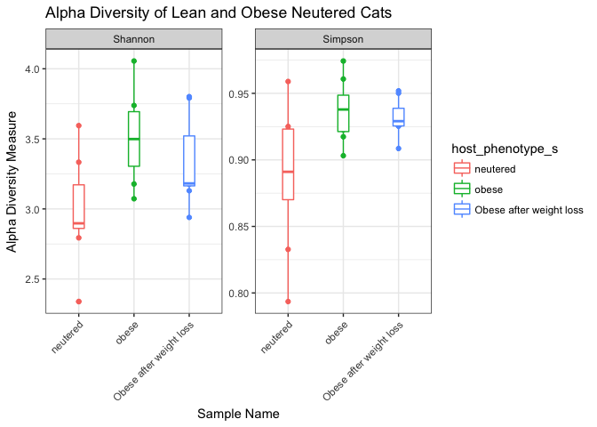
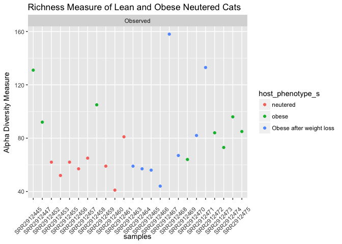

Final Report: Microbial Analysis in Lean and Obese Neutered Cats
================
Isabella Finney
December 14, 2017

Introduction
============

Manuel A. Fischer et al. published a paper titled *Effects of obesity, energy restriction and neutering on the faecal microbiota of cats* where they performed a broad experiment that looked at the overall differences in microbiota between leans cats that were neutered and intact and neutered obese cats that did and didn’t undergo energy restriction. The focus of my investigation was to observe the level of diversity using abundance and richness over the different types of neutered cats using the dataset I obtained from this study. Looking at these variables for this particular dataset, I hoped to determine exactly which microbial communities caused those differences. I hypothesized that there would be distinctive differences in the diversity and abundance in the microbial communities between lean and obese cats.

Methods
=======

Study design
------------

Twenty-four domestic shorthair cats, with ages ranging from 1-12 years, were obtained from the University of California. Using a body condition score system (Laflamme, 1997), Fischer et al. determined which cats were considered lean or obese. They chose eight obese (4 male and 4 female); eight lean intact (4 male and 4 female); and eight lean neutered (6 male and 2 female) cats. Neutered cats were either castrated or spayed about 1-6 years before the start of the study. To control the specimens’ environmental factors, all cats were housed together in a temperature and enriched controlled facility. Each cat was also brushed and socialized once a day. The scientists ensured that each cat was given the same dry-type diet for two before the experiment as well as throughout the duration of the study. They ensured that diet provided met all of the standard nutritional recommendations for cats of all ages (Freeman *et al.*, 2013). Cats were fed a diet that consisted of proportional rates of protein, fat, N-free extract, dietary fibre, and ash. Although food intake for each specimen was not exactly measured, weekly recordings showed that each cat kept a consistent weight. Particular steps were taken to preform energy restriction on obese neutered cats. For 10 days, these cats were briefly individually housed during their feeding times and were weighed to ensure food intake stability. For the next 6 weeks, the cats were fed 60-70% of their previous energy intake to obtain a 0.5-1% in weight loss every week. Each cat had their body weight measured every week and a body composition scored was recorded every other week.

Sample origin and sequencing
----------------------------

### Determining Body Composition

To determine body fat mass and fat free mass, Fischer et al. used a deuterium oxide (D2O) isotopic dilution method purchased from Fisher Scientific. This technique essentially applies a deuterium dilution to some bodily fluid in order to measure the total body water present in the body (Lukaski and Johnson, 1985). For this experiment, a blood sample was taken 12 hours after food fasting and 2 hours after water was withheld. To collect blood and faecal samples, each cat (obese, lean, intact, and neutered) was temporarily housed in a separate location. The dilution was applied to each subcutaneously, or “under the skin” and then after allowing the dilution to equilibrate from a few hours, another blood sample was collected. An IR spectrometer with a class 2A laser was used to analyze the sample.

### Faecal Collection and Bacterial Sequencing

Fresh faecal samples were collected from litter boxes once a day over the period of three days. These samples were placed in sterile tubes and stored at -80 degrees Celsius. To determine that each sample collected was considered “fresh”, Fischer and other staff at the facility observed the cats every 15 minutes and only the faeces produced during this time period was collected.A DNA extraction kit, sold as the Mo Bio PowerSoil Kit, used a bead-beading method on each sample to remove the DNA. This method works by placing beads into a tube sample and mechanically shaking the tube to create collisions between the sample material and the beads (Fujimoto *et al.*, 2004). After retrieving the DNA from each tube, the 16R rRNA genes were chosen to be sequenced from each sample. Amplification of this area was preformed using a universal bacterial primer. After, the scientists ran a series of 30-cycle PCR reactions to create multiple copies of each sequence. The amplicon products from each sample was were pooled together in equal concentrations to be purified with beads. The sequences were processed in a Roche 454 sequencer. The beads from the PCR reactions were placed into wells on a sequencing plate where nucleotide bases are added to each well. From there, light is given out to the wells and depending on the light intensity that the camera records, the wells will display the number of nucleotides of the same type (Rothberg and Leamon, 2008). Sequences were trimmed and those with less than 150 base pairs were removed as well as those with ambiguous base calls and large homopolymers. Operational taxonomic units (OTU) were gathered from de-noised sequences and chimeras were removed. Using BLASTn, these OTU were taxonomically classified against an established database. The OTU that were classified were compiled into each taxonomic level and rarefaction, or density lessening, was perfromed to remove biases within the sequences. The raw sequences were then deposited at the NCBI Sequence Read Archive.

Computational
-------------

The process to computationally parse and analyze the data gathered was accomplished using a systematic workflow. The process to computationally parse and analyze the data gathered was accomplished using a systematic workflow. The first step was to download the SRA table from NCBI. Using Terminal, I downloaded the SRA toolkit onto my computer and created a for loop script that would download the sequences. I then created an RScript that would parse the sequences downloaded. Next was to install all the necessary packages needed to get the dataset in the best suited format possible. The first step was to install all the necessary packages needed to get the dataset in the best suited format possible. In particular, the two most important packages that were installed were DADA2 and phyloseq. DADA2 is a type of open-software package that’s designed to model and correct Illumina-sequenced amplicon errors. It is able to directly extrapolate sequences and accurately resolve any error in as little as 1 nucleotide base (Callahan *et al.*, 2016). The phyloseq pack is also an open-software. This software project was made to preform analysis of microbiome census data present in R. It imports data and allows a user to preform various types of analysis like subsetting, multi-table comparisons, and diversity analysis (McMurdie and Holmes, 2013). This package essentially allowed me to make the different figures comparing the data between men and women. The metadata set was first downloaded from the NCBI database. Then through the creation of a fastq processing script, the metadata was thoroughly trimmed based on a set of parameters determined from the 454 sequencer. From here, DADA2 does its job to check for errors in each of the samples. After doing quality checks on the trimmed and denoised sequences, chimeras were removed from the sequences in order to obtain a clean read. Chimeras are formed from two miscloned and joined DNA sequences. The cleaned sequences variants were assigned taxonomy based on known sequences and then a phylogeny was created from a fasta file format of the data. A phyloseq object was constructed from the DADA2 output. Using dplyr and the psmelt function, a melted table was created from that phyloseq object. This process combines all the sample information, OTU, taxonomic classification into a single dataframe to produce graphics easily. Both objects were added to an Rmd file where I eventually created the figures for my analysis.

Results
=======

Subsections are ok in the results section too
---------------------------------------------

**Figure 1**: Alpha diversity measures of the three sample types, neutered obese and lean cats. Overall, there is a substantial amount of microbial diversty present among each sample type.

**Figure 2**: Alpha richness of each particular sample type.

**Figure 3**: This is an inferred phylogenetic tree of sequences present within the three sample types. The tips of the tree represents samples where each particular taxa occurred. The tree itself represents the maximum likelihood of phylogengy.

    ## Square root transformation
    ## Wisconsin double standardization
    ## Run 0 stress 0 
    ## Run 1 stress 0 
    ## ... Procrustes: rmse 0.197964  max resid 0.4437238 
    ## Run 2 stress 0 
    ## ... Procrustes: rmse 0.19856  max resid 0.4703534 
    ## Run 3 stress 0 
    ## ... Procrustes: rmse 0.2029136  max resid 0.4710915 
    ## Run 4 stress 0 
    ## ... Procrustes: rmse 0.1970864  max resid 0.4913527 
    ## Run 5 stress 0 
    ## ... Procrustes: rmse 0.1964678  max resid 0.4299426 
    ## Run 6 stress 0 
    ## ... Procrustes: rmse 0.1997249  max resid 0.4860232 
    ## Run 7 stress 0 
    ## ... Procrustes: rmse 0.2040667  max resid 0.4888075 
    ## Run 8 stress 0 
    ## ... Procrustes: rmse 0.1978519  max resid 0.4397756 
    ## Run 9 stress 0 
    ## ... Procrustes: rmse 0.1976063  max resid 0.5150685 
    ## Run 10 stress 0 
    ## ... Procrustes: rmse 0.1941372  max resid 0.4737125 
    ## Run 11 stress 0 
    ## ... Procrustes: rmse 0.1999958  max resid 0.4829969 
    ## Run 12 stress 0 
    ## ... Procrustes: rmse 0.1971207  max resid 0.4891795 
    ## Run 13 stress 0 
    ## ... Procrustes: rmse 0.196696  max resid 0.503792 
    ## Run 14 stress 0 
    ## ... Procrustes: rmse 0.1954114  max resid 0.4289217 
    ## Run 15 stress 0 
    ## ... Procrustes: rmse 0.1998709  max resid 0.4710926 
    ## Run 16 stress 0 
    ## ... Procrustes: rmse 0.2004592  max resid 0.4892891 
    ## Run 17 stress 0 
    ## ... Procrustes: rmse 0.1963506  max resid 0.4280638 
    ## Run 18 stress 0 
    ## ... Procrustes: rmse 0.2004653  max resid 0.4536555 
    ## Run 19 stress 0 
    ## ... Procrustes: rmse 0.1929209  max resid 0.4579162 
    ## Run 20 stress 0 
    ## ... Procrustes: rmse 0.194315  max resid 0.4358269 
    ## *** No convergence -- monoMDS stopping criteria:
    ##     20: stress < smin

**Figure 4**: Plot ordination of the taxa present from each type of neutered cat.

**Figure 5**: Bar plot representing the mean abundance of each phyla present in each sample type (lean netured, obese neutered, and obese and neutered with energy restriction).

**Figure 6**: Bar plot representing the mean abundance of the top 5 genera present in each sample type (lean netured, obese neutered, and obese and neutered with energy restriction).

| Genus                       |   neutered|      obese|  Obese after weight loss|
|:----------------------------|----------:|----------:|------------------------:|
| Alloprevotella              |         NA|   4.318750|                       NA|
| Aminiphilus                 |         NA|   5.812500|                       NA|
| Anaerobiospirillum          |   5.296875|   4.152344|                 6.097656|
| Blautia                     |   3.545530|         NA|                       NA|
| Catenibacterium             |   9.723684|         NA|                       NA|
| Clostridium\_sensu\_stricto |   6.973404|   5.710106|                       NA|
| Clostridium\_XI             |  28.154167|   5.277083|                 8.902083|
| Clostridium\_XlVa           |         NA|         NA|                 7.190790|
| Collinsella                 |         NA|   3.396342|                       NA|
| Eggerthella                 |         NA|         NA|                26.750000|
| Enterococcus                |   4.531250|         NA|                       NA|
| Faecalicoccus               |         NA|         NA|                 5.750000|
| Hydrogenoanaerobacterium    |         NA|         NA|                 6.138393|
| Megasphaera                 |   3.740385|   9.437500|                 9.478365|
| Olsenella                   |   7.812500|  29.837500|                27.687500|
| Prevotella                  |         NA|   8.286152|                 9.829044|
| Romboutsia                  |   6.323077|         NA|                       NA|
| Slackia                     |         NA|         NA|                 5.034091|
| Streptococcus               |         NA|   3.694444|                       NA|
| Turicibacter                |   5.453125|         NA|                       NA|

**Table 1**: Summary table showing the mean abundance values for the top 15 genera present among all three sample types.

In addition to a minimum of 5-10 figures/tables (and associated captions), you should include sufficient text in this section to describe what your findings were. Remember that in the results section you just describe what you found, but you don't interpret it - that happens in the discussion. 2-3 pages.

Discussion
==========

Add around 3-4 pages interpreting your results and considering future directions one might take in analyzing these data.

Sources Cited
=============

Callahan,B.J. *et al.* (2016) DADA2: High-resolution sample inference from illumina amplicon data. *Nature Methods*, **13**, 581–583.

Freeman,L.M. *et al.* (2013) Current knowledge about the risks and benefits of raw meat–based diets for dogs and cats. *Journal of the American Veterinary Medical Association*, **243**, 1549–1558.

Fujimoto,S. *et al.* (2004) Optimal bacterial dna isolation method using bead-beating technique. *Memoirs Kyushu Univ Dep Of Health Scis Of Medical Sch*, **3**, 33–38.

Laflamme,D. (1997) Development and validation of a body condition score system for cats: A clinical tool. *Feline practice (Santa Barbara, Calif.: 1990)(USA)*.

Lukaski,H.C. and Johnson,P.E. (1985) A simple, inexpensive method of determining total body water using a tracer dose of d2o and infrared absorption of biological fluids. *The American journal of clinical nutrition*, **41**, 363–370.

McMurdie,P.J. and Holmes,S. (2013) Phyloseq: An r package for reproducible interactive analysis and graphics of microbiome census data. *PLoS ONE*, **8**, e61217.

Rothberg,J.M. and Leamon,J.H. (2008) The development and impact of 454 sequencing. *Nature biotechnology*, **26**, 1117–1124.
