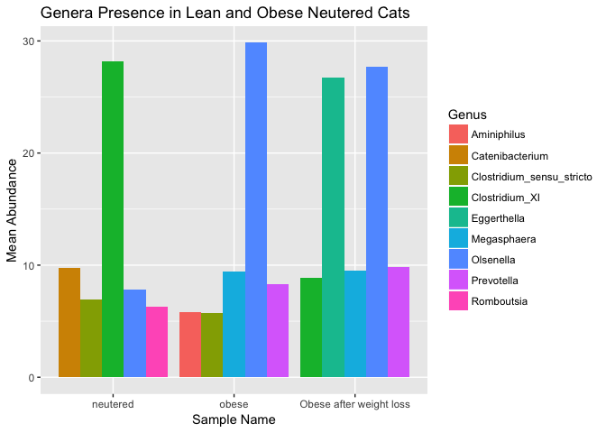

Final Report: Microbial Analysis in Lean and Obese Neutered Cats
================
Isabella Finney
December 14, 2017

Introduction
============

Add about 2-3 pages here. Across the whole manuscript, you should cite at least 20 peer reviewed articles.

Methods
=======

Study design
------------

Add about half a page here. In this section instead of first person (I/we), use the authors of the paper you selected, since you'll just be describing what they did, based on the methods in their paper.

Sample origin and sequencing
----------------------------

Add about half a page here. In this section instead of first person (I/we), use the authors of the paper you selected, since you'll just be describing what they did, based on the methods in their paper.

Computational
-------------

These are the methods you used to do your bioinformatic analyses analyses. Should probably be between 0.5 and 1 pages. At a very minimum should include citations for DADA2 and phyloseq if you are doing an amplicon study, or other citations as appropriate.

Results
=======

Subsections are ok in the results section too
---------------------------------------------

**Figure 1**: Alpha diversity measures of the three sample types, neutered obese and lean cats. Overall, there is a substantial amount of microbial diversty present among each sample type.

**Figure 2**: Alpha richness of each particular sample type.

**Figure 3**: This is an inferred phylogenetic tree of sequences present within the three sample types. The tips of the tree represents samples where each particular taxa occurred. The tree itself represents the maximum likelihood of phylogengy.

    ## Square root transformation
    ## Wisconsin double standardization
    ## Run 0 stress 0 
    ## Run 1 stress 0 
    ## ... Procrustes: rmse 0.2005476  max resid 0.504372 
    ## Run 2 stress 0 
    ## ... Procrustes: rmse 0.202496  max resid 0.4777993 
    ## Run 3 stress 0 
    ## ... Procrustes: rmse 0.1917057  max resid 0.4286122 
    ## Run 4 stress 0 
    ## ... Procrustes: rmse 0.2032725  max resid 0.4955563 
    ## Run 5 stress 0 
    ## ... Procrustes: rmse 0.1952372  max resid 0.5230318 
    ## Run 6 stress 0 
    ## ... Procrustes: rmse 0.1960075  max resid 0.477597 
    ## Run 7 stress 0 
    ## ... Procrustes: rmse 0.1991056  max resid 0.4892554 
    ## Run 8 stress 0 
    ## ... Procrustes: rmse 0.1983824  max resid 0.5020568 
    ## Run 9 stress 0 
    ## ... Procrustes: rmse 0.1981886  max resid 0.4774134 
    ## Run 10 stress 0 
    ## ... Procrustes: rmse 0.1995948  max resid 0.4777933 
    ## Run 11 stress 0 
    ## ... Procrustes: rmse 0.1992294  max resid 0.4779074 
    ## Run 12 stress 0 
    ## ... Procrustes: rmse 0.2021446  max resid 0.496509 
    ## Run 13 stress 0 
    ## ... Procrustes: rmse 0.1981925  max resid 0.4615156 
    ## Run 14 stress 0 
    ## ... Procrustes: rmse 0.2021729  max resid 0.4691497 
    ## Run 15 stress 0 
    ## ... Procrustes: rmse 0.1913531  max resid 0.4308444 
    ## Run 16 stress 0 
    ## ... Procrustes: rmse 0.1958799  max resid 0.479151 
    ## Run 17 stress 0 
    ## ... Procrustes: rmse 0.2018631  max resid 0.4749856 
    ## Run 18 stress 0 
    ## ... Procrustes: rmse 0.1988014  max resid 0.4761362 
    ## Run 19 stress 0 
    ## ... Procrustes: rmse 0.2005088  max resid 0.4875684 
    ## Run 20 stress 0 
    ## ... Procrustes: rmse 0.1985077  max resid 0.4567355 
    ## *** No convergence -- monoMDS stopping criteria:
    ##     20: stress < smin

**Figure 4**: Plot ordination of the taxa present from each type of neutered cat.

**Figure 5**: Bar plot representing the mean abundance of each phyla present in each sample type (lean netured, obese neutered, and obese and neutered with energy restriction).

**Figure 6**: Bar plot representing the mean abundance of the top 5 genera present in each sample type (lean netured, obese neutered, and obese and neutered with energy restriction).

| Genus                       |   neutered|      obese|  Obese after weight loss|
|:----------------------------|----------:|----------:|------------------------:|
| Alloprevotella              |         NA|   4.318750|                       NA|
| Aminiphilus                 |         NA|   5.812500|                       NA|
| Anaerobiospirillum          |   5.296875|   4.152344|                 6.097656|
| Blautia                     |   3.545530|         NA|                       NA|
| Catenibacterium             |   9.723684|         NA|                       NA|
| Clostridium\_sensu\_stricto |   6.973404|   5.710106|                       NA|
| Clostridium\_XI             |  28.154167|   5.277083|                 8.902083|
| Clostridium\_XlVa           |         NA|         NA|                 7.190790|
| Collinsella                 |         NA|   3.396342|                       NA|
| Eggerthella                 |         NA|         NA|                26.750000|
| Enterococcus                |   4.531250|         NA|                       NA|
| Faecalicoccus               |         NA|         NA|                 5.750000|
| Hydrogenoanaerobacterium    |         NA|         NA|                 6.138393|
| Megasphaera                 |   3.740385|   9.437500|                 9.478365|
| Olsenella                   |   7.812500|  29.837500|                27.687500|
| Prevotella                  |         NA|   8.286152|                 9.829044|
| Romboutsia                  |   6.323077|         NA|                       NA|
| Slackia                     |         NA|         NA|                 5.034091|
| Streptococcus               |         NA|   3.694444|                       NA|
| Turicibacter                |   5.453125|         NA|                       NA|

**Table 1**: Summary table showing the mean abundance values for the top 15 genera present among all three sample types.

In addition to a minimum of 5-10 figures/tables (and associated captions), you should include sufficient text in this section to describe what your findings were. Remember that in the results section you just describe what you found, but you don't interpret it - that happens in the discussion. 2-3 pages.

Discussion
==========

Add around 3-4 pages interpreting your results and considering future directions one might take in analyzing these data.

Sources Cited
=============
